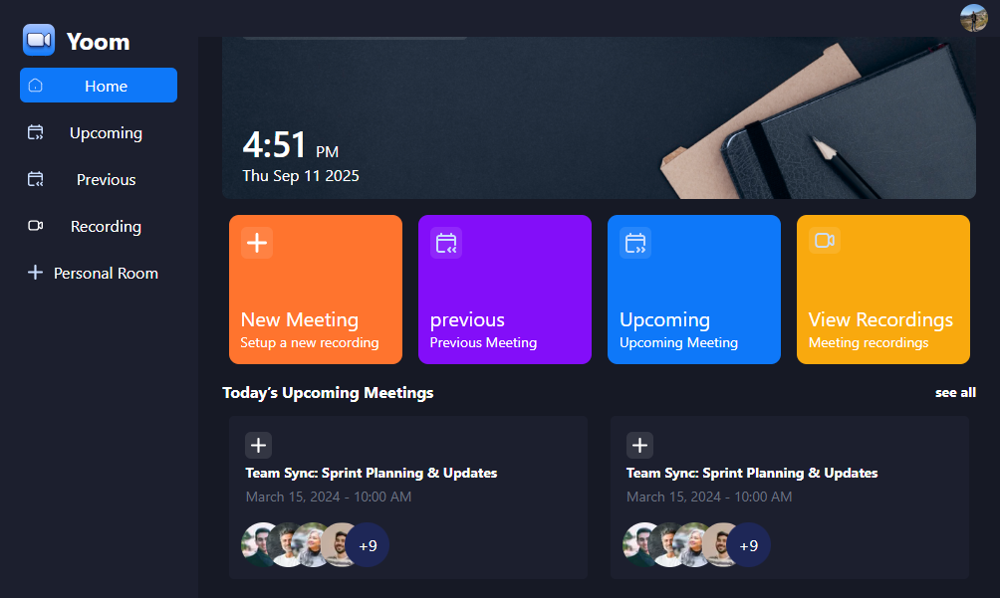

    <a href="https://zoom-app-puce.vercel.app/">
    
    <a>

&nbsp;&nbsp;&nbsp;
  
  NEXT.js

---

### Yoom - Video Conferencing Application

Yoom is a modern, intuitive video conferencing platform designed to streamline your virtual meetings and collaboration needs. With a clean interface and powerful features, Yoom makes remote communication seamless and efficient.

---

### <a name="tech-stack">⚙️ Tech Stack</a>

- Next.js
- TypeScript
- Clerk
- getstream
- shadcn
- Tailwind CSS